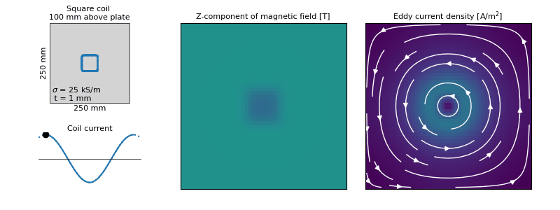

# eppy - Eddy Current Simulations for Induction Welding

[](https://opensource.org/licenses/MIT)

This module provides a basic simulation framework to calculate eddy
currents in flat, non-magnetic and isotropic, plates. The framework
consists of two modules:
* `coil_geom` to generate various coil geometries.
* `eppy` to calculate and visualize magnetic fields and eddy currents.

The `eppy` module itself consists of:
* Functions to calculate and visualize the magnetic field generated by
  a coil. The field strength is calculated using Biot-Savart.
* Functions to calculate and visualize the eddy currents in a flat
  non-magnetic plate. The eddy current distribution is calculated
  using the approach proposed by
  [Nagel](https://ieeexplore.ieee.org/document/8902282).
* A text parser that allows running simulations via an input file.


## Example

Before continuing, allow me to first to whet your appetite. Consider a
non-magnetic square plate with a thickness of 1 mm, an edge length of
250 mm, and an isotropic conductivity of 25 kS/m. Eddy currents are
generated in the plate by means of a square coil oriented parallel to
the plate at a distance of 10 mm. The coil, which has an edge length
of 50 mm and corner radii of 5 mm, is supplied with an alternating
current at a frequency of 250 kHz. The animation below shows the
problem outline and coil current on the left, the z-component of the
magnetic field at the location of the plate in the center, and the
eddy current density in the plate on the right.

<p align="center">
  
</p>

The calculation takes approximately 5 seconds of which most time is
spend generating the system matrix. The actual solving takes a
fraction of a second. Pretty cool, no? The
[script](examples/square_coil_parallel.py) used to generate the
animation can be found in the folder with examples.


## Installation and usage

You can simply clone the repository to your folder of choice using
[git](https://git-scm.com/downloads):

```
git clone https://github.com/wjbg/eppy.git
```


Use of this module via an interactive computing environment (e.g.
Jupyter) is recommended. All functions are reasonably well-documented
and the annotated examples should be sufficient to get you started.
Alternatively the module can be run from the command prompt to read an
input file with the simulation details. For example, in MS Windows:

```
python eppy.py examples\meander_coil.txt
```


## Background

This section provides (very) brief information on the generic approach
used to calculate the magnetic field generated by the coil and the
induced eddy currents in the laminate. Regarding the latter, the
reader is kindly referred to the excellent paper by
[Nagel](https://ieeexplore.ieee.org/document/8902282) in which the
mathematical approach clearly outlined.

### Magnetic field

The amplitude of the magnetic field generated by the coil is
determined using the Biot-Savart law.

<p align="center">
  
</p>

With reference to the image above, the Biot-Savart law relates the
magnetic field  at position
 to the
steady currents in for example a wire or a coil. In differential form
the Biot-Savart law yields:

<p align="center">

</p>

with 
an infinitesimal length of the conductor carrying a current , while  is the magnetic
constant. The displacement vector  represents the
direction and distance from the conductor element to the point where
the field is evaluated. The magnetic field as the result of a current
through a wire can be obtained by integrating the equation above along
the path of the wire:

<p align="center">

</p>


### Eddy currents

The eddy currents in a plate are determined using the method described
by Nagel. The plate is assumed to be very thin, which means that the
eddy currents will be constant over the plate thickness and have no
out-of-plane component. In addition, the plate is non-magnetic and has
an isotropic and uniform conductivity. The imposed magnetic field is
assumed to be sinusoidal, which allows the use of a phasor description
where all time derivatives equal , with  the angular
excitation frequency.

Considering the Maxwell-Faraday equation in differential form:

<p align="center">

</p>

where  is
the electric field intensity and  is the total
magnetic field intensity. Using Ohm's law:

<p align="center">

</p>

this yields:

<p align="center">

</p>

Nagel now introduces another vector field , called the
electric vector potential, such that:

<p align="center">

</p>

Rearranging then gives:

<p align="center">

</p>

which can be solved numerically for  using for
example (as is done here) the finite difference method. The in-plane
eddy currents can then be calculated as:

<p align="center">

</p>


## Citation

In case you make use of this work for scientific publications of any
kind, please make sure to cite the author of the underlying
mathematical framework used for determining the eddy currents:

```
@article{Nagel2019,
  author =       {Nagel, James R.},
  journal =      {IEEE Transactions on Magnetics},
  title =        {Finite-Difference Simulation of Eddy Currents in
                  Nonmagnetic Sheets via Electric Vector Potential},
  year =         {2019},
  volume =       {55},
  number =       {12},
  pages =        {1-8},
  doi =          {10.1109/TMAG.2019.2940204}}

```

In addition, the use of (parts of) this code can be cited as:
```
@misc{eppy2021,
  author =       {Grouve, Wouter J.B.},
  title =        {Eppy - Eddy Current Simulations for Induction Welding},
  year =         {2021},
  publisher =    {GitHub},
  journal =      {GitHub repository},
  howpublished = {\url{https://github.com/wjbg/eppy}}}
```


## License

Free as defined in the [MIT](https://choosealicense.com/licenses/mit/)
license.
